# Using the Watson Salesforce SDK to leverage Watson APIs in your Salesforce app

In this code pattern we will be using the new [Watson Salesforce SDK](https://github.com/watson-developer-cloud/salesforce-sdk) by interacting with various Watson APIs in [Apex](https://developer.salesforce.com/docs/atlas.en-us.apexcode.meta/apexcode/apex_intro_what_is_apex.htm), a Salesforce specific programming language. The Watson Salesforce SDK currently supports:

* IBM Conversation V1
* IBM Discovery V1
* IBM Language Translator V2
* IBM Natural Language Classifier V1
* IBM Natural Language Understanding V1
* IBM Personality Insights V3
* IBM Speech To Text V1
* IBM Text To Speech V1
* IBM Tone Analyzer V3
* IBM Visual Recognition V3

When the reader has completed this code pattern, they will understand how to:

* Create a Salesforce account.
* Install the Watson Salesforce SDK.
* Use the Watson Salesforce SDK to make calls to Watson Visual Recognition, Watson Discovery, and Watson Tone Analyzer APIs.
* Use the Lightning UI debugger to view the results of the APIs.

## Flow

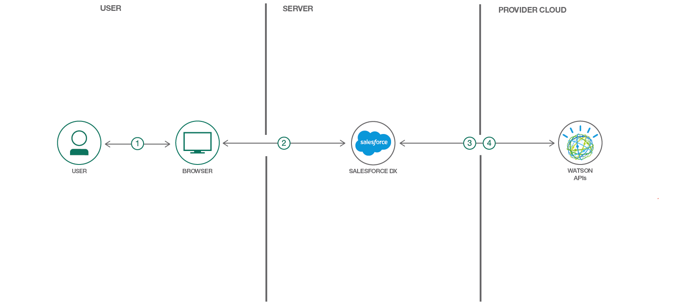

1. User logs into the Salesforce platform and brings up the Developer Console.
2. Write Apex code into the Developer Console using the Watson Salesforce SDK.
3. Execute the Apex code that calls the Watson APIs.
4. The Watson API results are returned to the Salesforce Developer Console debugger.

## Included components

* [Watson Visual Recognition](https://www.ibm.com/watson/developercloud/visual-recognition.html): Visual Recognition understands the contents of images - visual concepts tag the image, find human faces, approximate age and gender, and find similar images in a collection.
* [IBM Watson Discovery](https://www.ibm.com/watson/developercloud/discovery.html): A cognitive search and content analytics engine for applications to identify patterns, trends, and actionable insights.
* [IBM Watson Tone Analyzer](https://www.ibm.com/watson/developercloud/speech-to-text.html): Uses linguistic analysis to detect communication tones in written text.

## Featured Technologies

* [Salesforce DX](https://login.salesforce.com): An integrated, end-to-end platform designed for high-performance agile development.
* [Apex](https://developer.salesforce.com/docs/atlas.en-us.apexcode.meta/apexcode/apex_dev_guide.htm): A strongly typed, object-oriented programming language that allows developers to execute flow and transaction control statements on the Lightning Platform server, in conjunction with calls to the API.

# Watch the Video

[](https://www.youtube.com/watch?v=MyNiHnVgZ1s)

# Steps

## Prerequisites

* Sign up for a [Salesforce DX trial](https://developer.salesforce.com/signup).
* Log into your [Salesforce DX account](https://login.salesforce.com).
* Install the [SFDX CLI](https://developer.salesforce.com/tools/sfdxcli).
* Sign up for [IBM Cloud](https://console.bluemix.net).
* Provision a few Watson services. (*Click the links below to directly provision an instance*):
  * [Watson Discovery](https://console.bluemix.net/catalog/services/discovery)
  * [Watson Visual Recognition](https://console.bluemix.net/catalog/services/visual-recognition)
  * [Watson Tone Analyzer](https://console.bluemix.net/catalog/services/tone-analyzer/)

## Configure the SFDX CLI

To use the Watson Salesforce SDK we have to upload it's contents to the Salesforce DX platform. To accomplish this we first clone the repository, then convert the contents to a specific format (Metadata API) that the Salesforce DX platform uses. Then finally push the converted contents to our authenticated user session. Note, that ideally a specific version should be used when cloning the repository but for this code pattern we will use the `master` branch.

First we clone the repo and change into it's directory.

```shell
git clone https://github.com/watson-developer-cloud/salesforce-sdk
cd salesforce-sdk
```

Use the `sfdx force:auth:web:login` command from a shell to authenticate with a specific user. The shell session now has a form of delegated authorization of that user. This command launches a browser pointed to the Salesforce DX platform and prompts the user to sign-in. Upon signing in successfully a message will be prompted to the shell.

```shell
$ sfdx force:auth:web:login -s
Successfully authorized myemail@gmail.com with org ID 00D6A000001izOFUAY
You may now close the browser
```

Now that we have the SDK cloned locally and authenticated as a user we can convert the SDK content to the Metadata API format that is expected by the Salesforce DX platform using the `sfdx force:source:convert` command.

```shell
$ sfdx force:source:convert -d mdapioutput
Source was successfully converted to Metadata API format and written to the location: /Users/stevemar/workspace/salesforce-sdk/mdapioutput
```

Lastly we use the `sfdx force:mdapi:deploy` to deploy the converted contents to our authenticatd session.

```shell
$ sfdx force:mdapi:deploy -d mdapioutput/ -w 100
289718 bytes written to /var/folders/2j/fjvydk2x1rs3rdy99m6hcw2r0000gn/T/mdapioutput.zip using 202.997ms
Deploying /var/folders/2j/fjvydk2x1rs3rdy99m6hcw2r0000gn/T/mdapioutput.zip...

=== Status
Status:  Pending
jobid:  0Af6A00000UGfRSSA1
Component errors:  0
Components deployed:  0
Components total:  0
Tests errors:  0
Tests completed:  0
Tests total:  0
Check only: false


=== Status
Status:  InProgress
jobid:  0Af6A00000UGfRSSA1
Component errors:  0
Components deployed:  0
Components total:  53
Tests errors:  0
Tests completed:  0
Tests total:  0
Check only: false


=== Status
Status:  InProgress
jobid:  0Af6A00000UGfRSSA1
Component errors:  0
Components deployed:  0
Components total:  53
Tests errors:  0
Tests completed:  0
Tests total:  0
Check only: false


=== Status
Status:  InProgress
jobid:  0Af6A00000UGfRSSA1
Component errors:  0
Components deployed:  0
Components total:  53
Tests errors:  0
Tests completed:  0
Tests total:  0
Check only: false


Deployment finished in 22000ms

=== Result
Status:  Succeeded
jobid:  0Af6A00000UGfRSSA1
Completed:  2018-02-20T19:15:47.000Z
Component errors:  0
Components deployed:  53
Components total:  53
Tests errors:  0
Tests completed:  0
Tests total:  0
Check only: false
```

Though not necessary to run it is handy, especially when debugging, to view the organizations tied to a specific account using the `sfdx force:org:list` command.

```shell
$ sfdx force:org:list
     ALIAS   USERNAME           ORG ID              CONNECTED STATUS
───  ──────  ─────────────────  ──────────────────  ────────────────
(D)  DevHub  myemail@gmail.com  00D0Y000001LvYSUA0  Connected
```

Now that our SFDX CLI is set up we can proceed to the next section where we allow our Salesforce account to call out to Watson APIs.

## Allow remote calls from Salesforce DX

Before we start making API calls to Watson we need to configure one final thing in our Salesforce DX platform. We need to allow remote calls to the Watson API URLs. To do this, we visit the [Remote Site Details](https://na50.lightning.force.com/one/one.app#/setup/SecurityRemoteProxy/home) section of our Salesforce DX platform.

There should be a single entry for making calls to the `ApexDevNet` URL `http://www.apexdevnet.com`. We will add to this list by adding two URLs that are specific to Watson APIs. Below is the completed image and for completeness we will show screenshots of the details for both entries.

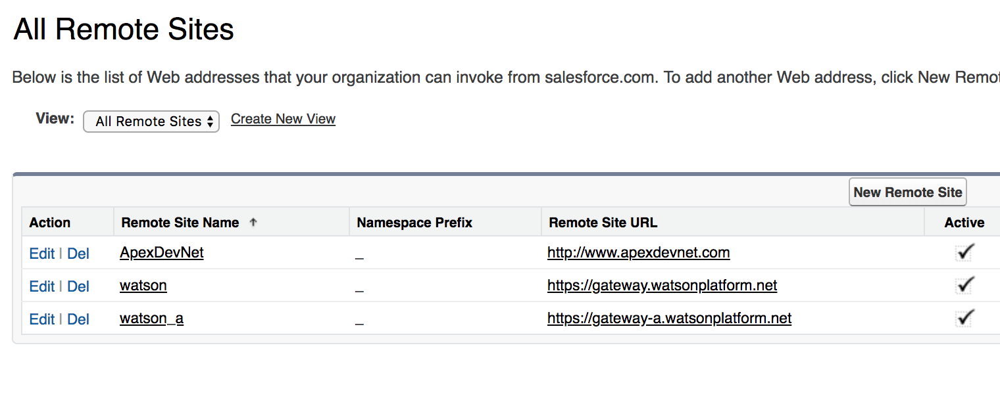

Add two new entries using the *New Remote Site* button. The `Remote Site Name` field for the entries is not important but the `Remote Site URL` fields must match the following list:

* `https://gateway.watsonplatform.net`
* `https://gateway-a.watsonplatform.net`

> Adding the `https://gateway.watsonplatform.net` remote site.

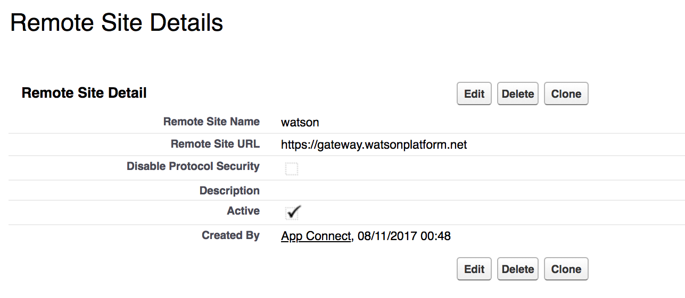

> Adding the `https://gateway-a.watsonplatform.net` remote site.

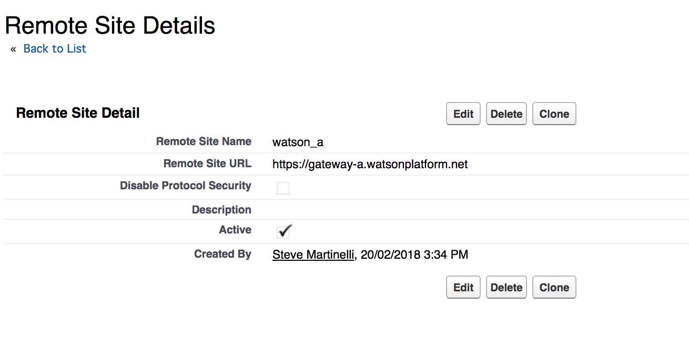

Now that we have allowed remote calls to the Watson APIs and deployed the Watson Salesforce SDK we are ready to start making calls!

## Using the Watson Salesforce SDK

> *REMINDER:* Ensure the Watson services you intend to use are provisioned in IBM Cloud before proceeding!

### Go to the Developer Console

Log into Salesforce DX by going to [https://login.salesforce.com](https://login.salesforce.com) and clicking the gear icon on the top right and selecting the `Developer Console` option. This will bring up a new window that, among many other tasks, allows a user to run snippets of Apex code in a debugger.

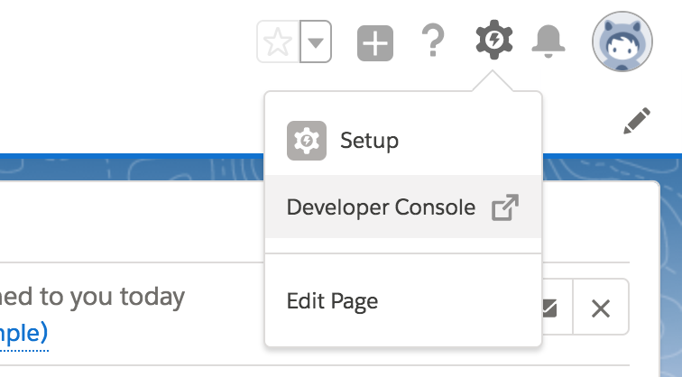

Now we're ready to run some code! From the *Developer Console* click the *Debug* menu and the *Open Execute Anonymous Windows* to bring up a new window that allows a user to execute Apex code. From here follow along in the sections below and click the *Execute* button. A few tips:

* Be sure to select the *Open Log* checkbox.
* Be sure to remove any old code between the sections below.

### Watson Discovery News

We'll start by making a few Watson Discovery calls to the Discovery News service. Copy the following code block into the Apex editor and update the `username` and `password` variables with the credentials from your own provisioned Watson Discovery service and execute the code.

The code block below does the following: 1) It creates a new Watson Discovery object. 2) It updates said object with the specified `username` and `password` variables. 3) It makes a call to the Discovery News service about `IBM`. And 4) it logs the response as a debug content.


```java
IBMDiscoveryV1 discovery = new IBMDiscoveryV1(IBMDiscoveryV1.VERSION_DATE_2017_09_01);
String username = '6f7be0c0-xxxxxxxxxx-1d5e9eb4050c';
String password = 'xxxxxxxxxx';
String url = 'https://gateway.watsonplatform.net/discovery/api';
discovery.setUsernameAndPassword(username, password);
discovery.setEndPoint(url);
IBMDiscoveryV1Models.QueryOptions options 
  = new IBMDiscoveryV1Models.QueryOptionsBuilder()
    .environmentId('system')
    .collectionId('news')
    .naturalLanguageQuery('IBM')
    .count(5)
    .build();
IBMDiscoveryV1Models.QueryResponse response = discovery.query(options);
System.debug(response);
```

The results should look like the screenshot below. We can see the first result is an article about an *Offering Management Lead for Automotive and Connected Vehicles for IBM's Watson IoT Business Unit*. As well as a few other responses from the server about `publication_date`, `sentiment` and other fields from Discovery.

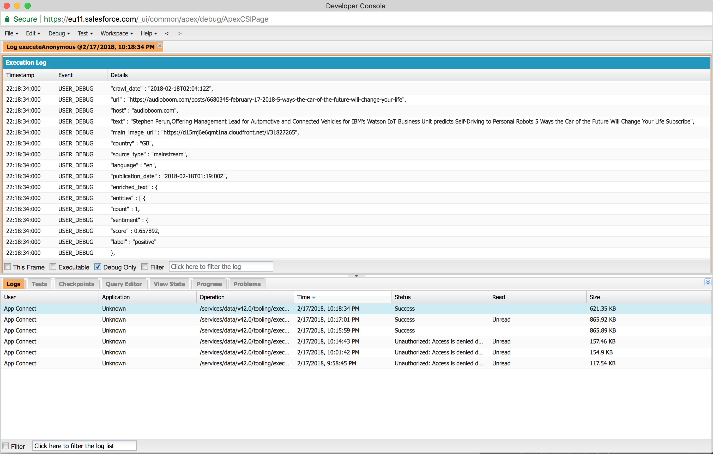

To keep ourselves honest we made the same call with the tooling available on IBM Cloud. Note the same results are returned in the screenshot below.

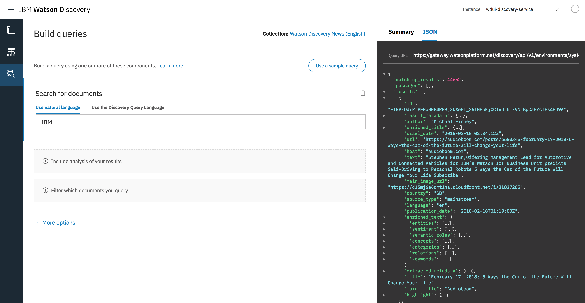

### Watson Visual Recognition

Now we'll make a simple Watson Visual Recognition call using an image available online. Copy the following code block into the Apex editor and update the `api_key` variable with the value from your own provisioned Watson Visual Recognition service and execute the code.

The code block below is similar to our Watson Discovery example with a few minor changes. It does the following: 1) It creates a new Watson Visual Recognition object. 2) It updates said object with the specified `api_key` value. 3) It makes a call to the Watson Visual Recognition service using an image of an apple. And 4) it logs the response as a debug content.

```java
String service_url = 'https://gateway-a.watsonplatform.net/visual-recognition/api/';
String api_key = '76150a9f51a4a3fxxxxxxxxxx77a05b08246e9f';
IBMVisualRecognitionV3 visualRecognition = new IBMVisualRecognitionV3(IBMVisualRecognitionV3.VERSION_DATE_2016_05_20, api_key);
visualRecognition.setEndPoint(service_url);
visualRecognition.setApiKey(api_key);
String parameters = '{"url":"https://upload.wikimedia.org/wikipedia/commons/f/f4/Honeycrisp.jpg"}';
IBMVisualRecognitionV3Models.ClassifyOptions options = new IBMVisualRecognitionV3Models.ClassifyOptionsBuilder()
  .parameters(parameters)
  .build();
IBMVisualRecognitionV3Models.ClassifiedImages resp = visualRecognition.classify(options);
System.debug('IBMVisualRecognitionV3FTest.testClassify(): ' + resp);
```

The results should look like the screenshot below. We can see that the Watson Visual Recognition service believe the object in the image to be an `apple` with `0.957` confidence (out of `1`). We also see a few other results returned from the server with varying levels of confidence.

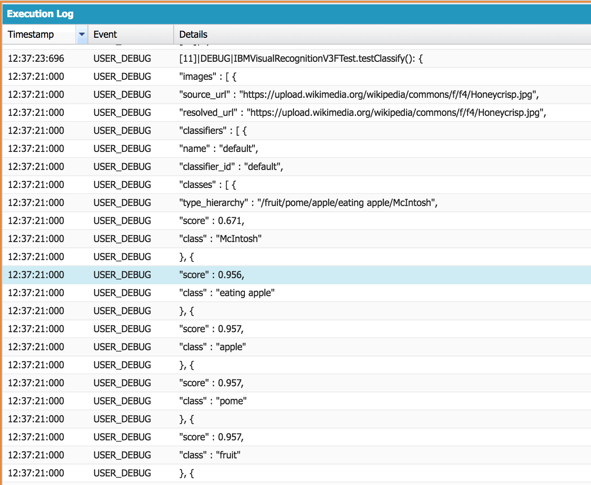

To keep ourselves honest we can try the same image with a free online demo of Watson Visual Recognition available at: [https://visual-recognition-demo.ng.bluemix.net](https://visual-recognition-demo.ng.bluemix.net). Note the same results are returned as the Watson Salesforce SDK.

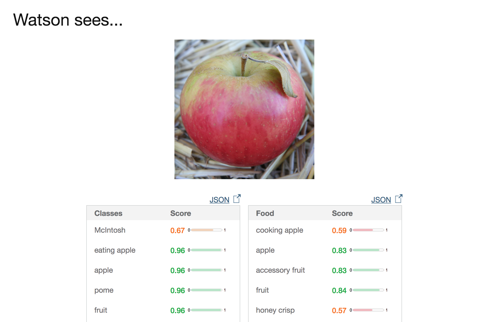

### Watson Tone Analyzer

Alright, one last example using Watson's Tone Analyzer. Copy the code block below into the Apex editor and update the `username` and `password` variables with the value from your own provisioned Watson Tone Analyzer service and execute the code.

The code block below is similar to our others examples with a few minor changes. It does the following: 1) It creates a new Watson Tone Analyzer object. 2) It updates said object with the specified `username` and `password` values. 3) It makes a call to the Watson Tone Analyzer service using the phrase *We have a better product. We need to do better selling*. And 4) it logs the response as a debug content.

```java
String service_url = 'https://gateway.watsonplatform.net/tone-analyzer/api';
String username = '3baf41e5-xxxxxxxxxx-5eb5e9b5a79b';
String password = 'xxxxxxxxxx';

IBMToneAnalyzerV3 toneAnalyzer = new IBMToneAnalyzerV3('2017-09-21');
toneAnalyzer.setEndPoint(service_url);
toneAnalyzer.setUsernameAndPassword(username, password);

IBMToneAnalyzerV3Models.ToneOptions options = new IBMToneAnalyzerV3Models.ToneOptionsBuilder()
    .text('We have a better product. We need to do better selling')
    .addTones('social')
    .sentences(false)
    .contentLanguage('en')
    .acceptLanguage('en')
    .build();

IBMToneAnalyzerV3Models.ToneAnalysis resp = toneAnalyzer.tone(options);
System.debug('IBMToneAnalyzerV3FTest.testTone(): ' + resp);
```

The results should look like the screenshot below. We can see that the Watson Tone Analyzer service believes the phrase to have a `tone` of `analytical` and with a `score` of `0.8298` (out of `1`). 

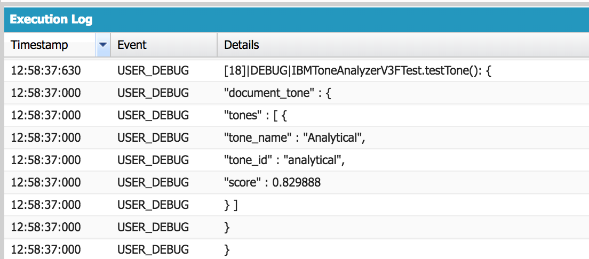

To keep ourselves honest we can try the same image with a free online demo of Watson Tone Analyzer available at: [https://tone-analyzer-demo.ng.bluemix.net](https://tone-analyzer-demo.ng.bluemix.net). Note the same results are returned as the Watson Salesforce SDK.

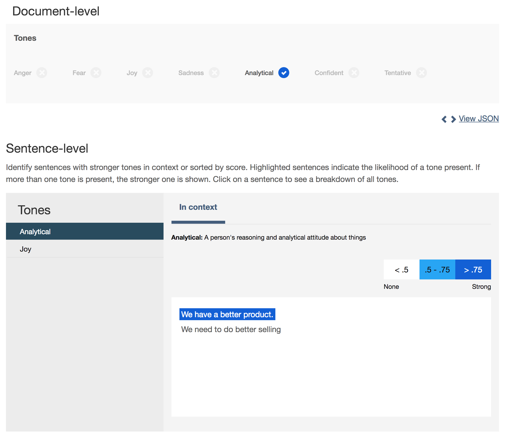

# Summary

Congratulations! Now go on and make awesome Salesforce apps that use IBM Watson APIs! We hope that the new SDK will make it easy to integrate Watson into your Salesforce apps by offering a simple, consistent interface.

If you're interested in exploring further or would like some resources to reference in the future see the [References](#references) section below.

# References

* [The Watson Salesforce SDK](https://github.com/watson-developer-cloud/salesforce-sdk)
* [Recording of Dreamforce presentation speaking about IBM & Salesforce partnership, Watson & Einstein and the SDK](https://www.salesforce.com/video/1770876)
* [Watson Salesforce SDK Walkthrough Videos](https://www.youtube.com/playlist?list=PLZDyxLlNKRY8qrs90oRPvVHocJhYOOj3n)

### Labs
* [Lab about Watson Disovery with the Watson Salesforce SDK](https://github.com/watson-developer-cloud/salesforce-sdk/tree/master/examples/discovery)
* [Lab about Watson Conversation with the Watson Salesforce SDK](https://github.com/watson-developer-cloud/salesforce-sdk/tree/master/examples/conversation)

### Blogs
* [SDK Announcement](https://developer.ibm.com/dwblog/2017/watson-apex-sdk-salesforce-applications/)
* [SDK Extended Support](https://developer.ibm.com/dwblog/2018/watson-salesforce-sdk-apis-apex-applications/)
* [SDK Business Value](https://developer.ibm.com/dwblog/2018/watson-salesforce-sdk-details/)
* [SDK & Discovery example](https://developer.ibm.com/dwblog/2017/watson-discovery-apex-sdk-salesforce/)
* [SDK & Conversation example](https://developer.ibm.com/dwblog/2017/watson-conversation-apex-sdk-salesforce/)
* [Introducing the IBM Watson SDK for Salesforce](https://developer.salesforce.com/blogs/2017/11/introducing-ibm-watson-sdk-salesforce.html)

### Troubleshooting Salesforce
* [Useful SXFD CLI commands](http://matheusgoncalves.com/salesforce-dx-useful-cli-commands/)
* [How to enable Dev Hub in your production Salesforce org](https://developer.salesforce.com/docs/atlas.en-us.sfdx_setup.meta/sfdx_setup/sfdx_setup_enable_devhub.htm)

# Learn more

* **Artificial Intelligence Code Patterns**: Enjoyed this Code Pattern? Check out our other [AI Code Patterns](https://developer.ibm.com/code/technologies/artificial-intelligence/).
* **AI and Data Code Pattern Playlist**: Bookmark our [playlist](https://www.youtube.com/playlist?list=PLzUbsvIyrNfknNewObx5N7uGZ5FKH0Fde) with all of our Code Pattern videos
* **With Watson**: Want to take your Watson app to the next level? Looking to utilize Watson Brand assets? [Join the With Watson program](https://www.ibm.com/watson/with-watson/) to leverage exclusive brand, marketing, and tech resources to amplify and accelerate your Watson embedded commercial solution.

# License

[Apache 2.0](LICENSE)
