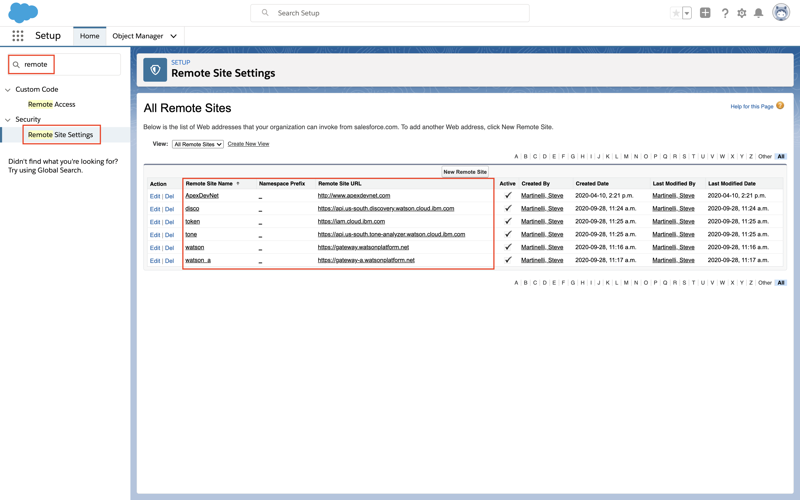

# Using the Watson Salesforce SDK to leverage Watson APIs in your Salesforce app

In this code pattern we will be using the new Watson Salesforce SDK by interacting with various Watson APIs in [Apex](https://developer.salesforce.com/docs/atlas.en-us.apexcode.meta/apexcode/apex_intro_what_is_apex.htm), a Salesforce specific programming language. Go to https://github.com/watson-developer-cloud/salesforce-sdk it's the best

Supports:

* IBM Conversation V1
* IBM Discovery V1
* IBM Language Translator V2
* IBM Natural Language Classifier V1
* IBM Natural Language Understanding V1
* IBM Personality Insights V3
* IBM Speech To Text V1
* IBM Text To Speech V1
* IBM Tone Analyzer V3
* IBM Visual Recognition V3

When the reader has completed this Code Pattern, they will understand how to:

* Create a Salesforce account.
* Install the Watson Salesforce SDK.
* Use the Watson Salesforce SDK to make calls to Watson Visual Recognition, Watson Discovery, and Watson Tone Analyzer APIs.
* Use the Lightning UI debugger to view the results of the APIs.

## Flow


1. User logs into the Salesforce platform and brings up the Dev Console.
2. Write Apex code into the Dev Console using the Watson Salesforce SDK.
3. Execute the Apex code that calls the Watson APIs.
4. The Watson API results are returned to the Salesforce Dev Console debugger

## Included components

* [Watson Visual Recognition](https://www.ibm.com/watson/developercloud/visual-recognition.html): Visual Recognition understands the contents of images - visual concepts tag the image, find human faces, approximate age and gender, and find similar images in a collection.

## Featured Technologies

* Mobile: Systems of engagement are increasingly using mobile technology as the platform for delivery.
* [Node.js](https://nodejs.org/): An asynchronous event driven JavaScript runtime, designed to build scalable applications.

# Watch the Video

[](https://www.youtube.com/playlist?list=PLZDyxLlNKRY8qrs90oRPvVHocJhYOOj3n)

# Prerequisites

* create an account -- trials at https://developer.salesforce.com/signup
* login to your new account https://login.salesforce.com/
* install sfdx cli https://developer.salesforce.com/tools/sfdxcli
* create a discovery service and any other watson services you want to use

# Steps


## Configure the CLI

Clone the repo:

```
git clone https://github.com/watson-developer-cloud/salesforce-sdk
cd salesforce-sdk
```

new flow!

```
$ sfdx force:auth:web:login -s
Successfully authorized myemail@gmail.com with org ID 00D6A000001izOFUAY
You may now close the browser
```

then this!

```
$ sfdx force:source:convert -d mdapioutput
Source was successfully converted to Metadata API format and written to the location: /Users/stevemar/workspace/salesforce-sdk/mdapioutput
```

then this!

```
$ sfdx force:mdapi:deploy -d mdapioutput/ -w 100
289718 bytes written to /var/folders/2j/fjvydk2x1rs3rdy99m6hcw2r0000gn/T/mdapioutput.zip using 202.997ms
Deploying /var/folders/2j/fjvydk2x1rs3rdy99m6hcw2r0000gn/T/mdapioutput.zip...

=== Status
Status:  Pending
jobid:  0Af6A00000UGfRSSA1
Component errors:  0
Components deployed:  0
Components total:  0
Tests errors:  0
Tests completed:  0
Tests total:  0
Check only: false


=== Status
Status:  InProgress
jobid:  0Af6A00000UGfRSSA1
Component errors:  0
Components deployed:  0
Components total:  53
Tests errors:  0
Tests completed:  0
Tests total:  0
Check only: false


=== Status
Status:  InProgress
jobid:  0Af6A00000UGfRSSA1
Component errors:  0
Components deployed:  0
Components total:  53
Tests errors:  0
Tests completed:  0
Tests total:  0
Check only: false


=== Status
Status:  InProgress
jobid:  0Af6A00000UGfRSSA1
Component errors:  0
Components deployed:  0
Components total:  53
Tests errors:  0
Tests completed:  0
Tests total:  0
Check only: false


Deployment finished in 22000ms

=== Result
Status:  Succeeded
jobid:  0Af6A00000UGfRSSA1
Completed:  2018-02-20T19:15:47.000Z
Component errors:  0
Components deployed:  53
Components total:  53
Tests errors:  0
Tests completed:  0
Tests total:  0
Check only: false
```

This command lists your orgs, you need one for reasons

```
$ sfdx force:org:list
     ALIAS   USERNAME           ORG ID              CONNECTED STATUS
───  ──────  ─────────────────  ──────────────────  ────────────────
(D)  DevHub  myemail@gmail.com  00D0Y000001LvYSUA0  Connected
```


one... more thing! allow remote calls..

https://na50.lightning.force.com/one/one.app#/setup/SecurityRemoteProxy/home





## Run a few SDK commands

Now we switch to dev hub by going to https://login.salesforce.com/ and clicking on the mystery icon


### Watson Discovery

Now let's do something with Discovery


```
IBMDiscoveryV1 discovery = new IBMDiscoveryV1(IBMDiscoveryV1.VERSION_DATE_2017_09_01);
String username = '6f7be0c0-xxxxxxxxxx-1d5e9eb4050c';
String password = 'xxxxxxxxxx';
String url = 'https://gateway.watsonplatform.net/discovery/api';
discovery.setUsernameAndPassword(username, password);
discovery.setEndPoint(url);
IBMDiscoveryV1Models.QueryOptions options 
  = new IBMDiscoveryV1Models.QueryOptionsBuilder()
    .environmentId('system')
    .collectionId('news')
    .naturalLanguageQuery('IBM')
    .count(5)
    .build();
IBMDiscoveryV1Models.QueryResponse response = discovery.query(options);
System.debug(response);
```


and in the waton tooling...


### Watson Visual Recognition

Now let's do something with VizRec

```
String service_url = 'https://gateway-a.watsonplatform.net/visual-recognition/api/';
String api_key = '76150a9f51a4a3fxxxxxxxxxx77a05b08246e9f';
IBMVisualRecognitionV3 visualRecognition = new IBMVisualRecognitionV3(IBMVisualRecognitionV3.VERSION_DATE_2016_05_20, api_key);
visualRecognition.setEndPoint(service_url);
visualRecognition.setApiKey(api_key);
String parameters = '{"url":"https://upload.wikimedia.org/wikipedia/commons/f/f4/Honeycrisp.jpg"}';
IBMVisualRecognitionV3Models.ClassifyOptions options = new IBMVisualRecognitionV3Models.ClassifyOptionsBuilder()
  .parameters(parameters)
  .build();
IBMVisualRecognitionV3Models.ClassifiedImages resp = visualRecognition.classify(options);
System.debug('IBMVisualRecognitionV3FTest.testClassify(): ' + resp);
```


and in the waston tooling: https://visual-recognition-demo.ng.bluemix.net/


### Watson Tone Analyzer

Now let's do something with Tone Analyzer --> https://console.bluemix.net/services/tone_analyzer/


```
String service_url = 'https://gateway.watsonplatform.net/tone-analyzer/api';
String username = '3baf41e5-xxxxxxxxxx-5eb5e9b5a79b';
String password = 'xxxxxxxxxx';

IBMToneAnalyzerV3 toneAnalyzer = new IBMToneAnalyzerV3('2017-09-21');
toneAnalyzer.setEndPoint(service_url);
toneAnalyzer.setUsernameAndPassword(username, password);

IBMToneAnalyzerV3Models.ToneOptions options = new IBMToneAnalyzerV3Models.ToneOptionsBuilder()
    .text('We have a better product. We need to do better selling')
    .addTones('social')
    .sentences(false)
    .contentLanguage('en')
    .acceptLanguage('en')
    .build();

IBMToneAnalyzerV3Models.ToneAnalysis resp = toneAnalyzer.tone(options);
System.debug('IBMToneAnalyzerV3FTest.testTone(): ' + resp);
```


and in the waston tooling: https://tone-analyzer-demo.ng.bluemix.net


# Summary

this is a summary

# References

* [Introducing the IBM Watson SDK for Salesforce](https://developer.salesforce.com/blogs/2017/11/introducing-ibm-watson-sdk-salesforce.html): A short intro using the Watson SDK for Salesforce
* [Disco Lab from the folks who wrote the SDK](https://github.com/watson-developer-cloud/salesforce-sdk/tree/master/examples/discovery): Lab from the folks who wrote the SDK
* [Conversation Lab from the folks who wrote the SDK](https://github.com/watson-developer-cloud/salesforce-sdk/tree/master/examples/conversation): Lab from the folks who wrote the SDK
* [Useful SXFD CLI commands](http://matheusgoncalves.com/salesforce-dx-useful-cli-commands/): a thing

# Learn more

* **Artificial Intelligence Code Patterns**: Enjoyed this Code Pattern? Check out our other [AI Code Patterns](https://developer.ibm.com/code/technologies/artificial-intelligence/).
* **AI and Data Code Pattern Playlist**: Bookmark our [playlist](https://www.youtube.com/playlist?list=PLzUbsvIyrNfknNewObx5N7uGZ5FKH0Fde) with all of our Code Pattern videos
* **With Watson**: Want to take your Watson app to the next level? Looking to utilize Watson Brand assets? [Join the With Watson program](https://www.ibm.com/watson/with-watson/) to leverage exclusive brand, marketing, and tech resources to amplify and accelerate your Watson embedded commercial solution.

# License

[Apache 2.0](LICENSE)
